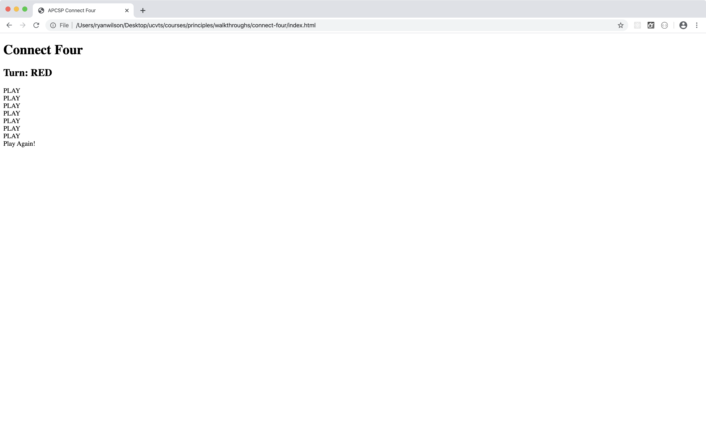
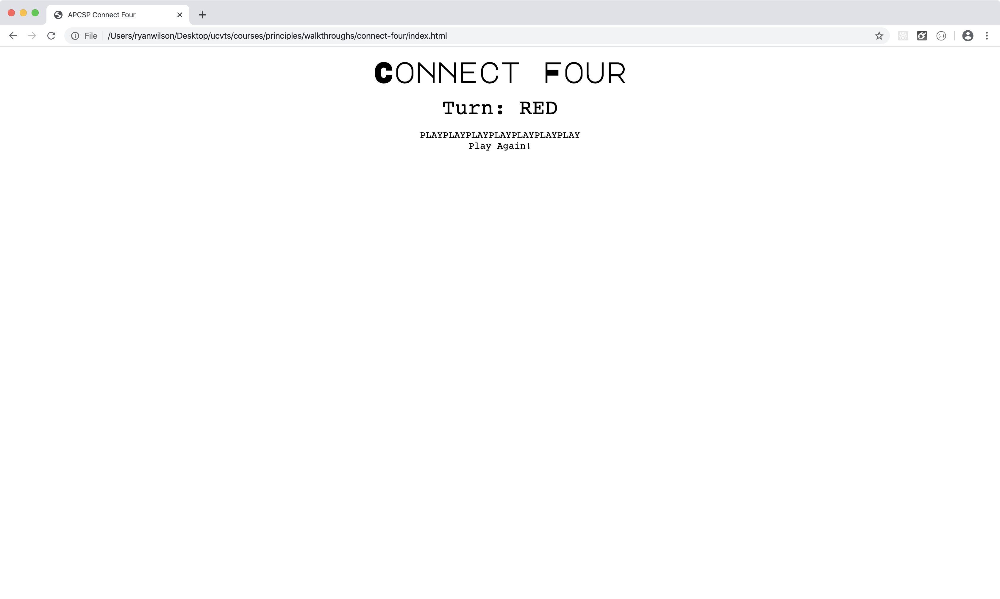
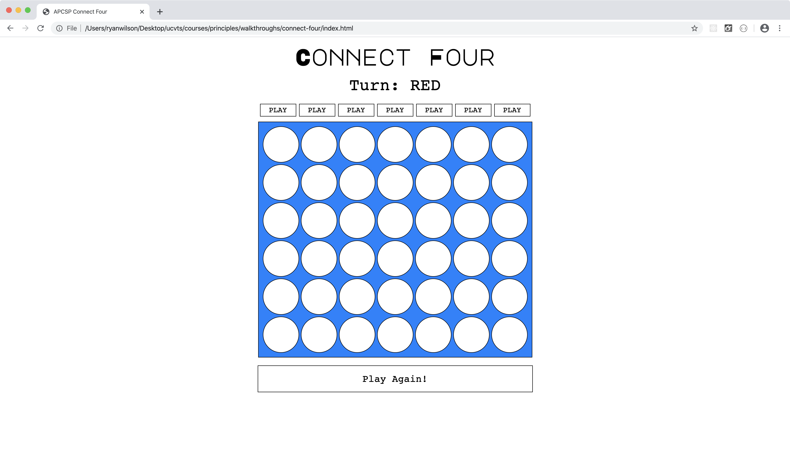

# Connect Four Walkthrough

When working on a large-scale project or application, it's critical that you divide the workload into more manageable chunks. While this isn't a very large project, we can use it as a stepping stone to learn where and how to start a project when all we have are requirements.

Follow along carefully. Although you're copying what I'm doing, it's important that you take the time to understand the decisions I'm making. Stop, ask questions, experiment with the code. This is what good programmers do, and it's the only way you'll truly grasp the material.

## Requirements

This is a pretty simple game, and one we've all played at some point in our lives. The requirements aren't too extensive, but they are precise.

- Display a 7-by-6 grid of circles.
- Indicate the current state of the game.
  - Has a player won, and if so, who?
  - Has the game ended in a tie?
  - Whose turn is it?
- Allow each player to place pieces on the board in alternating fashion.
  - Prevent players from placing a piece where a piece already exists.
- Provide a means to reset the game and play again.

## Basic Structure

Before we dive into the requirements, let's create our project structure. Every project needs a root directory, so create a folder (and call it whatever you'd like).

Inside of your parent folder, create two additional folders.

- `css`
- `js`

And three files.

- `index.html`
- `js/app.js`
- `css/styles.css`

Now, your project structure should look like this.

```
connect-four/
  css/
    styles.css
  js/
    app.js
  index.html
```

Next, open up the `index.html` file. A basic template has a `head` and `body` section, which will initially be empty.

```html
<!DOCTYPE html>

<html lang="en">
  <head>
    <meta charset="UTF-8" />
    <meta name="viewport" content="width=device-width, initial-scale=1.0" />
    <meta http-equiv="X-UA-Compatible" content="ie=edge" />

    <title>Connect Four</title>
  </head>
  <body>
    <!-- we'll fill this in later -->
  </body>
</html>
```

Lastly, hook up your CSS and JavaScript to your HTML template.

```html
<!DOCTYPE html>

<html lang="en">
  <head>
    <meta charset="UTF-8" />
    <meta name="viewport" content="width=device-width, initial-scale=1.0" />
    <meta http-equiv="X-UA-Compatible" content="ie=edge" />

    <link
      href="https://fonts.googleapis.com/css?family=Major+Mono+Display"
      rel="stylesheet"
    />
    <link href="css/styles.css" rel="stylesheet" type="text/css" />
    <script defer src="js/app.js"></script>

    <title>Connect Four</title>
  </head>
  <body>
    <!-- we'll fill this in later -->
  </body>
</html>
```

If you're paying attention, you probably noticed that we have two CSS files. One is ours, which we created in the `css` folder. The other is from Google APIs. It lets us use a particular font.

## User Stories

A user story is an informal description of a feature or use case of a software system. These are commonly used in the planning and design stages of the software development lifecycle. We're writing a connect four app, so let's talk about what behaviors we'll need to support.

### Gameboard

This is the foundation of the entire game, and it's usually represented by a 3-by-3 grid. Let's start with the presentation layer, which is how we'll display the board in the browser.

Put this in the `body` of your HTML.

```html
<h1>Connect Four</h1>
<div id="home-button"><a href="index.html">&#x1F3E0;</a></div>

<h2>Turn: RED</h2>
<div class="container column">
  <div id="board-header" class="container cell-header-group">
    <div id="0" class="cell-header">PLAY</div>
    <div id="1" class="cell-header">PLAY</div>
    <div id="2" class="cell-header">PLAY</div>
    <div id="3" class="cell-header">PLAY</div>
    <div id="4" class="cell-header">PLAY</div>
    <div id="5" class="cell-header">PLAY</div>
    <div id="6" class="cell-header">PLAY</div>
  </div>
  <div class="container wrap" id="board">
    <div class="cell"></div>
    <div class="cell"></div>
    <div class="cell"></div>
    <div class="cell"></div>
    <div class="cell"></div>
    <div class="cell"></div>
    <div class="cell"></div>
    <div class="cell"></div>
    <div class="cell"></div>
    <div class="cell"></div>
    <div class="cell"></div>
    <div class="cell"></div>
    <div class="cell"></div>
    <div class="cell"></div>
    <div class="cell"></div>
    <div class="cell"></div>
    <div class="cell"></div>
    <div class="cell"></div>
    <div class="cell"></div>
    <div class="cell"></div>
    <div class="cell"></div>
    <div class="cell"></div>
    <div class="cell"></div>
    <div class="cell"></div>
    <div class="cell"></div>
    <div class="cell"></div>
    <div class="cell"></div>
    <div class="cell"></div>
    <div class="cell"></div>
    <div class="cell"></div>
    <div class="cell"></div>
    <div class="cell"></div>
    <div class="cell"></div>
    <div class="cell"></div>
    <div class="cell"></div>
    <div class="cell"></div>
    <div class="cell"></div>
    <div class="cell"></div>
    <div class="cell"></div>
    <div class="cell"></div>
    <div class="cell"></div>
    <div class="cell"></div>
  </div>

  <div id="reset-button">Play Again!</div>
</div>
```

Without a little CSS, our board isn't going to look very much like a board. Go ahead and open up your `index.html` file in the browser and you'll see what I mean.

<kbd></kbd>

Pretty ugly, I know. So let's style it - and feel free to modify these styles however you'd like!

```css
/*
 * Sets the overall styles for the page. There aren't many. All text is
 * centered, and the font is a monospaced Roboto (from Google).
 */

body {
  text-align: center;
  font-family: "Roboto", monospace;
}

/*
 * The header has a different font than the rest of the page. It's the title, so
 * it makes sense to make it a little different (and bigger).
 */

h1 {
  font-family: "Major Mono Display", monospace;
  font-size: 48px;
  margin: 1%;
}

/*
 * The subheader (which let's us know whose turn it is) is a little smaller and
 * less prominent.
 */

h2 {
  font-size: 36px;
  font-weight: lighter;
  margin: 1%;
  margin-top: 0;
}

/*
 * The container is a flex-box, which is a powerful layout tool. It grows
 * dyanamically, and allows us to position our elements with precision.
 *
 * This encloses everything from the turn indicator to the reset button.
 */

.container {
  align-items: center;
  display: flex;
  justify-content: center;
}

/*
 * We want to display the subheader, play buttons, board, and reset button
 * in a single vertical column.
 */

.column {
  flex-direction: column;
  height: 100%;
  width: 100%;
}
```

We're not done yet, but we've made some progress. Refresh the page and you'll see that our fonts have been applied, and everything is positioned in a vertical column centered on the page.

<kbd></kbd>

Where's the board, though? Since the `div`s representing the board and its interior circles are empty, there's nothing to display. We can add borders to render the grid on the page.

The board itself will have a background color (a shade of blue), while the circles remain empty. This will create the appearance of a physical board with empty slots. If you've ever seen a real Connect Four board, you'll know what I mean.

```css
/*
 * This ensures that we get the right number of rows and columns, rather
 * than a single row of 42 circles.
 *
 * The height and width are based on the size of the squares that enclose
 * the circles, including their borders.
 */

.wrap {
  flex-wrap: wrap;
  height: 486px;
  width: 567px;
}

/*
 * This positions play buttons above the board, providing a little spacing.
 */

.cell-header-group {
  margin-bottom: 0.5%;
  width: 583px;
}

/*
 * The play buttons themselves, with size and spacing.
 */

.cell-header {
  cursor: pointer;
  border: 1px solid black;
  height: 25px;
  line-height: 25px;
  margin: 3px;
  user-select: none;
  width: 75px;
}

/*
 * And we give it a little flare when the user mouses over a button.
 */

.cell-header:hover {
  background-color: black;
  color: white;
}

/*
 * The board is a shade of blue, which differentiates it from the
 * circles and gives it a more realistic feel.
 */

#board {
  background-color: #0080ff;
  border: 1px solid black;
  padding: 7px;
}

/*
 * The circles themselves have no background at first. The border radius
 * is what makes these elements appear circular.
 */

.cell {
  background-color: white;
  border: 1px solid black;
  border-radius: 50%;
  height: 75px;
  margin: 2px;
  width: 75px;
}
```

Refresh again and things should be much closer to what we want. The board is now visible, and the squares highlight when we hover over them.

<kbd></kbd>

The only thing left to style is the reset button.

```css
/*
 * The reset button sits just below the board.
 */

#reset-button {
  background-color: white;
  border: 1px solid black;
  color: black;
  cursor: pointer;
  font-size: 21px;
  line-height: 55px;
  margin: 1%;
  text-align: center;
  width: 583px;
}

/*
 * And a little flare when the user mouses over the button. The color scheme
 * switches (background and foreground).
 */

#reset-button:hover {
  background-color: black;
  color: white;
}
```

<kbd></kbd>

Flexbox is a powerful layout tool, but there's a bit of a learning curve associated with it. Don't be shy - [dive into the documentation](https://css-tricks.com/snippets/css/a-guide-to-flexbox/) and try it out yourself!